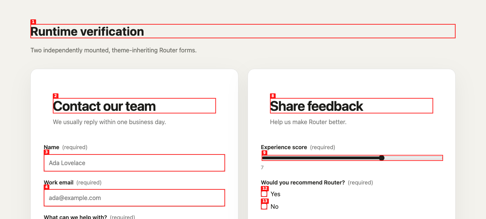

# Dogfood Report: Router Forms Runtime

| Field | Value |
|-------|-------|
| **Date** | 2026-09-01 |
| **App URL** | http://127.0.0.1:4175/dogfood-output/runtime-fixture.html |
| **Session** | router-forms-runtime |
| **Scope** | Public light-DOM runtime, multiple forms, accessibility tree, desktop/mobile, reduced motion |

## Summary

| Severity | Count |
|----------|-------|
| Critical | 0 |
| High | 0 |
| Medium | 1 |
| Low | 1 |
| **Total** | **2** |

## Issues

### ISSUE-001: Generic embeds introduce duplicate level-one headings

| Field | Value |
|-------|-------|
| **Severity** | low |
| **Category** | accessibility |
| **URL** | http://127.0.0.1:4175/dogfood-output/runtime-fixture.html |
| **Repro Video** | N/A |
| **Status** | Resolved during verification |

**Description**

Each embedded form rendered its title as an `h1`, producing three level-one headings on a host page with two forms. Hosted forms should own the page heading; generic and WordPress embeds should fit the host hierarchy.

**Repro Steps**

1. Open the two-form fixture and inspect the annotated accessibility view. Both form titles appear as level-one headings alongside the page heading.
   

---

### ISSUE-002: Choice group legends lack fieldset semantics

| Field | Value |
|-------|-------|
| **Severity** | medium |
| **Category** | accessibility |
| **URL** | http://127.0.0.1:4175/dogfood-output/runtime-fixture.html |
| **Repro Video** | N/A |
| **Status** | Resolved during verification |

**Description**

Radio, yes/no, and checkbox-group labels were emitted as `legend` elements inside ordinary `div` elements. The visual label appeared, but the accessibility tree did not associate it with the choice group.

**Repro Steps**

1. Open the fixture and inspect the feedback form. The annotated radio/checkbox controls are visible, but their group names are absent from the accessibility hierarchy.
   

---

## Verified

- Desktop runtime with two independent mounts.
- Correct page-level `h1` plus embedded `h2` hierarchy after remediation.
- Native fieldset/legend group names present in the accessibility tree.
- Empty submission moves focus to the first invalid required field.
- Keyboard order proceeds from name to email to select without a focus trap.
- 390 px mobile viewport has no horizontal overflow (`scrollWidth = innerWidth = 390`).
- Reduced-motion media preference is honored and both mounts remain initialized.
- No browser exceptions after desktop or mobile rendering.

Post-fix evidence: [desktop](screenshots/desktop-fixed.png) and [mobile reduced motion](screenshots/mobile-reduced-motion.png).
